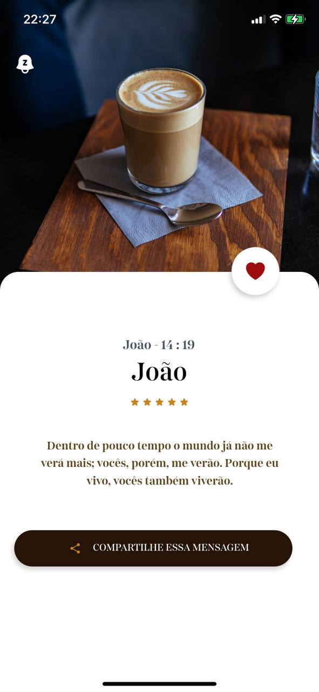
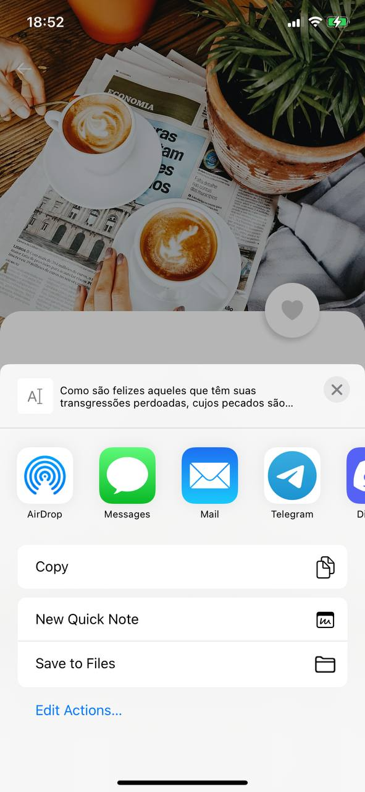

### ❓ Holy Notification

- App criado para estudar a integração do tailwindcss ao react-native, a ideia do app consiste em todos os dias enviar uma push notification com alguma mensagem biblica ao usuario.

### ⚠️ Features

- Recupear aleatoriamente uma mensagem biblica
- Botão para like e deslike da mensagem
- Estrelas para medir o grau de satisfção com a mensagem

## 📱 Current state

<code>

</code>
<code>

</code>
<code>

</code>

<code>

</code>

## 📌 Find me!

- Linkedin: https://www.linkedin.com/in/franklysg/
- Instagram: https://www.instagram.com/franklysg/
- Github: https://github.com/franklysg
